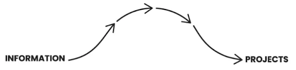
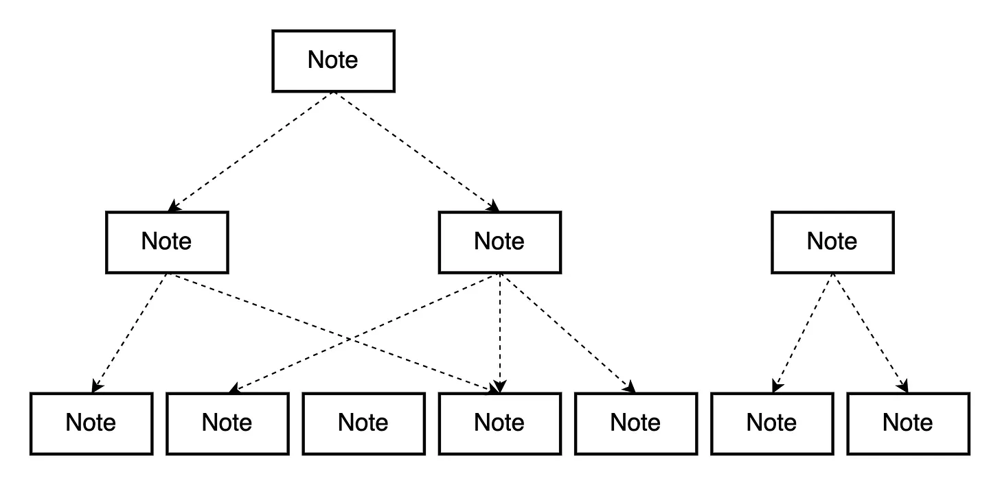
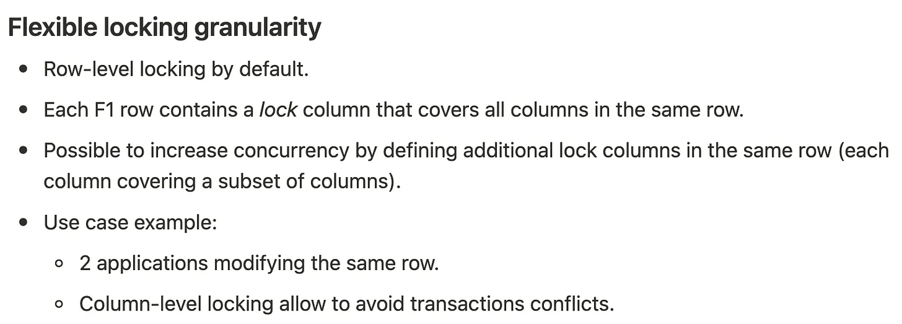
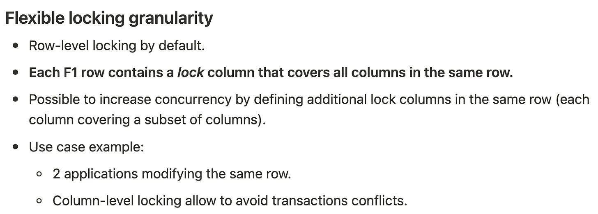
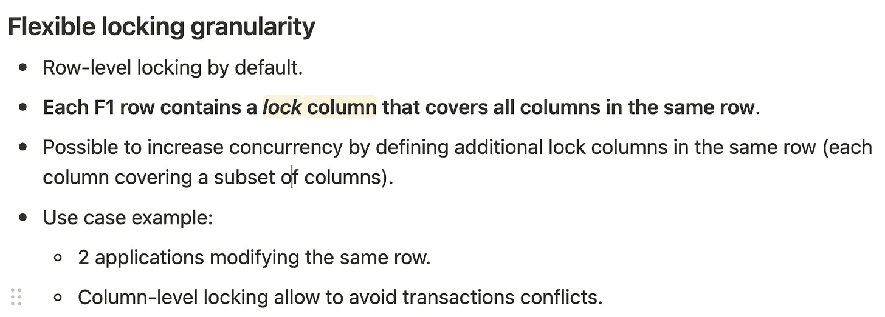
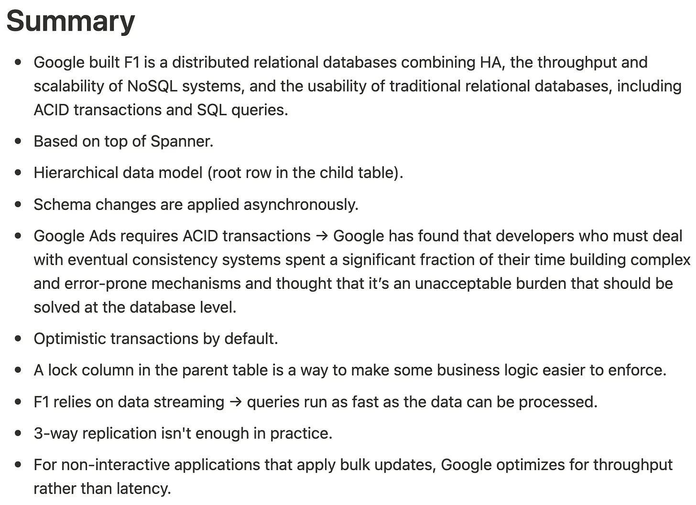

# Second Brain

Hello! I'm [Teiva Harsanyi](https://teivah.dev), a **software engineer at Google**. I'm the author of [100 Go Mistakes and How to Avoid Them](https://www.goodreads.com/book/show/58571862-100-go-mistakes-and-how-to-avoid-them) and the creator of [The Coder Cafe](https://thecoder.cafe) newsletter.

For over a decade, I failed miserably at keeping **an effective note-taking system**, mostly for two reasons:

1. I never had a single, centralized place. I used to rely on a combination of Notion + Apple Notes + a physical notebook + Kindle highlights + Anki.

1. I didn’t have a system that was generic enough. I had a different format pretty much every time: book summaries, posts, computer science notes, mistake journal, personal growth notes, and so on.

The result was a messy system that didn’t scale. I kept losing knowledge, and it made learning inefficient. When we read or watch a great resource but don’t capture what we learned from it, chances are high that within a few months or even weeks, that knowledge fades away. That’s what kept happening to me.

**Then I discovered the [*Second Brain*](https://www.goodreads.com/book/show/59616977-building-a-second-brain) method and it changed everything for me**.

## ❓ What's a Second Brain?

Our brain is great for processing ongoing tasks, but it’s not meant to retain everything. Over time, it lets go of unused ideas to make room for more relevant ones. This process, referred to as synaptic pruning, helps us adapt, but it also means we lose what we don’t externalize.

**That’s the promise of a second brain: a place to offload notes and thoughts, avoid losing knowledge, and build on it over time with new ideas.**

Before switching to the second brain approach, I also struggled with my notes because I wanted everything to be perfect. That drained a lot of time and energy. For me, the breakthrough was the following:

> We have to remember that we are not building an encyclopaedia of immaculately organized knowledge. We are building a working system. […] For that reason, you should prefer a system that is imperfect, but that continues to be useful in the real conditions of your life.

I stopped chasing perfection and started building something that simply works, something that supports me every day, both at work and in my personal life.

## 🤔 Mindset

Knowledge work is about taking information and turning it into results, for example, delivering on a project. All day, we consume and then produce:



Simple diagram showing a one-way flow from "Information" to "Projects" with a curved arrow.
The problem with this approach is that most of the information that we will gain will eventually be lost. Sure, we might remember the most important parts for a while. But what about the rest? It will fade, eventually.

**What we miss is a feedback loop, a way to recycle information into knowledge that we can reuse later:**


Circular flow diagram showing how "Information" turns into "Knowledge" and then into "Projects" through a feedback loop.
**That’s what a second brain gives us: a way to turn information into assets we can reinvest in the future.**

## 🧩 Notes as Building Blocks

Another interesting idea is to stop seeing notes as a flat list of things we’ve saved. Our notes can become building blocks, meaning pieces that help us create new ideas later on.



That’s a powerful shift: notes aren’t just storage, **they’re raw material for thinking**. They can connect and evolve into new ideas. Being able to track down all your notes in a single place makes those connections easier to spot and build on.

## 🗒️ What's a Note?

So, what’s a note?

> A piece of content, interpreted through your lens, curated according to your taste, translated into your own words, or drawn from life experience, and stored in a secure place.

Let’s go over the different parts of that definition.

First, a note is **something to use, not just to collect**. Again, we’re not building an encyclopaedia, we’re building something that works for us. For example, if we’re interested in public speaking, we don’t need a note on every single resource we read or watch.

Instead, we should be asking a few questions to decide what’s worth capturing:

- Does it inspire us?

- Is it useful?

- Is this personal?

- Is it surprising?

Ultimately, we should capture what **resonates**.

For example, we may have read this amazing book that everyone is talking about and discover that it doesn’t resonate with us at all. Conversely, we may have watched a 30-second video that had a profound effect on us and triggered emotions. In this case, it’s better to spend some time creating a note on this video rather than the book.

When something resonates with us, it’s our emotion-based, intuitive mind telling us it’s interesting before our logical mind can explain why.

## ✍️ How to Take Notes

Every time we take a note, we should ask: “_How can I make this as useful as possible for my future self?_”

One way to do that is to be mindful of our future limited time. Instead of tracking dozens, if not hundreds, of lines, we should focus on finding the essence, meaning the heart and soul of what a resource is trying to communicate.

But in some cases, that’s barely possible. For example, I read the [F1: A distributed SQL database that scales](https://static.googleusercontent.com/media/research.google.com/en//pubs/archive/41344.pdf) whitepaper. How can we capture the essence of such a dense technical document containing so much valuable information?

The solution is to use the progressive summarization technique. In short, it’s about layering our notes:

- **Layer 1 - Captured notes**: Either a copy and paste or even better writing, down in our own words what we understood from it.

<div align="center">
  
</div>

- **Layer 2 - Bolded passages**: Go over the captured notes and mark in bold the most important pieces.

<div align="center">
  
</div>

- **Layer 3 - Highlighted passages**: Go over the bolded passages and highlight the most important pieces.

<div align="center">
  
</div>

- **Layer 4 - Summary**: Write down a summary.

<div align="center">
  
</div>

In the end, the note looks like this:

```markdown
# Summary

- ...
- ...
- ...

# Highlights

## Architecture

## Data model

## Locking

## Etc.
```

This approach allows me to come back later and start with a quick summary to refresh the main ideas. If I need a bit more, I can scan the bolded and highlighted passages. And if I really want to dive deeper, I can go through all the highlights.

Of course, every layer is optional. If we consider that a resource only needs layers 1 and 4 of summarization, or just 1 and 2, that’s perfectly fine.

**Again, our second brain should be something that works for us.**

## 🗂️ PARA

The PARA system is at the core of the method. It is designed for actionability, with layers of action. To make things clear, a note can be assigned to one of the following domains:

- **Project**: A short-term effort with a possible due date and a clear outcome that needs to happen in order to mark the project as complete. For example, publish a blog post about second brain.

- **Area**: Ongoing responsibilities, what we are committed to, and what requires constant attention.

- **Resource**: A catchall for anything that doesn’t belong to a project or an area.

- **Archive**: When a note becomes inactive or outdated, we can move it to the archive.

The PARA system has two main benefits.

- **Clear focus**: We’re not mixing short-term efforts with long-term maintenance. It helps us focus on outcomes and next steps rather than just piles of information.

- **Genericity**: PARA can handle all kinds of notes. It organizes information based on how actionable it is, not what kind of information it is.

As I said, I used to lack a system that was generic enough to track all my notes. Now, whether it’s a book I read, a course I followed, or a post I came across, I capture everything that resonates with me using the PARA system.

## 🔧 Templates

- [Notion](notion.md)
